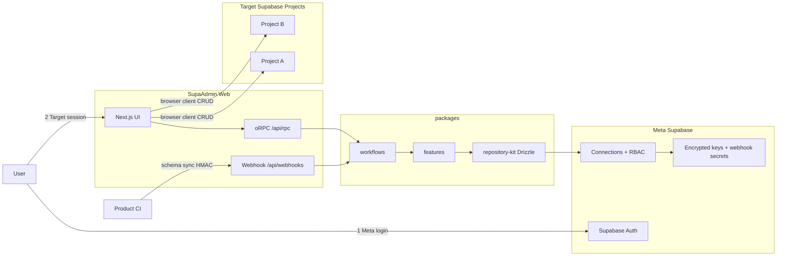

# SupaAdmin

[](https://github.com/vividstudio-inc/supa-admin/actions/workflows/ci.yml)
[](https://codecov.io/gh/vividstudio-inc/supa-admin)
[](LICENSE)
[](package.json)
[](https://github.com/vividstudio-inc/supa-admin/releases)

Self-hosted admin panel for operating multiple Supabase projects from a single UI.

[Quick Start](#quick-start) · [Architecture](#architecture) · [Features](#features) · [Contributing](CONTRIBUTING.md) · [日本語](docs/ja/README.md)

## Table of contents

- [What & Why](#what--why)
- [Live Demo](#live-demo)
- [Architecture](#architecture)
- [Tech stack](#tech-stack)
- [Quick Start](#quick-start)
- [Two-stage authentication](#two-stage-authentication)
- [Monorepo structure](#monorepo-structure)
- [Scripts](#scripts)
- [Environment](#environment)
- [API](#api)
- [Security](#security)
- [Deploy](#deploy)
- [Features](#features)
- [Out of scope](#out-of-scope)
- [Documentation](#documentation)
- [Contributing](#contributing)
- [License](#license)

## What & Why

SupaAdmin helps teams manage **multiple Target Supabase projects** through one admin interface. User accounts, connection registry, and RBAC live in a dedicated **Meta** Supabase project. CRUD against Target databases uses the browser Supabase client directly.

Compared to the Supabase Dashboard:

- **Multi-connection** — register and switch between Target projects
- **Team RBAC** — per-connection, per-table permissions for members
- **Encrypted credentials** — Target `service_role` keys stored encrypted in Meta (you manage the keys)

## Live Demo

> **Demo URL:** TBD — self-hosted only for now. See [Quick Start](#quick-start) to run locally.

## Architecture



See [docs/architecture.md](docs/architecture.md) for layering, dependencies, and the dual-Supabase model.

## Tech stack


## Quick Start

**Prerequisites:** Docker Desktop, Supabase CLI, Node 22.18+, pnpm 9.15+

```bash
corepack enable
pnpm install
pnpm db:start          # Meta (5432x) + Target (5442x)
pnpm setup:local       # env + reset + seed local Target connection
pnpm dev               # http://127.0.0.1:3000
```

| Stack | Studio | API | DB |
|-------|--------|-----|-----|
| Meta (`supabase/`) | http://127.0.0.1:54323 | 54321 | 54322 |
| Target (`supabase-target/`) | http://127.0.0.1:54423 | 54421 | 54422 |

## Two-stage authentication

1. **Meta login** — Supabase Auth on the Meta project (platform users).
2. **Target session** — per-connection browser Supabase client for end-user auth on Target projects.

## Monorepo structure

```
apps/web/                    Next.js app (@supa-admin/web)
packages/features/           Domain + application use cases (feature-*)
packages/workflows/          Multi-domain orchestration
packages/shared/             db, ddd, errors, repository-kit, crypto, auth, rls, schema, ...
tooling/                     tsconfig, vitest-config
supabase/                    Meta migrations (CI-generated from Drizzle)
supabase-target/             Target sample schema + RLS helpers
scripts/                     db:start, architecture-check, setup:local
```

## Scripts

| Command | Description |
|---------|-------------|
| `pnpm dev` | Start Next.js dev server |
| `pnpm build` | Production build |
| `pnpm test` | Vitest (Meta Supabase required) |
| `pnpm test:coverage` | Vitest with coverage report |
| `pnpm lint` | Biome check |
| `pnpm lint:arch` | dependency-cruiser architecture rules (R1–R7) |
| `pnpm architecture-check` | Static grep harness (A1–A4) |
| `pnpm typecheck` | Turbo typecheck |
| `pnpm db:start` | Start Meta + Target Supabase |
| `pnpm setup:local` | Full local bootstrap |

## Environment

Copy `.env.example` → `apps/web/.env.local` or run `pnpm setup:env-local` after `pnpm db:start`.

| Variable | Description |
|----------|-------------|
| `NEXT_PUBLIC_META_SUPABASE_URL` | Meta Supabase URL |
| `NEXT_PUBLIC_META_SUPABASE_ANON_KEY` | Meta anon key |
| `META_SUPABASE_SERVICE_ROLE_KEY` | Meta service role (server-only) |
| `ENCRYPTION_KEY` | 64-char hex AES-256-GCM key |
| `DATABASE_URL` | Meta Postgres (Drizzle/Vitest) |
| `NEXT_PUBLIC_APP_URL` | App URL (default http://127.0.0.1:3000) |

## API

Meta DB operations use **oRPC** at `/api/rpc`. Target CRUD uses the browser Supabase client directly.

**CI schema sync Webhook** (per-connection HMAC secret):

```bash
curl -X POST "$APP_URL/api/webhooks/schema-sync" \
  -H "Content-Type: application/json" \
  -H "X-SupaAdmin-Signature: sha256=$(printf '%s' '{"connectionId":"..."}' | openssl dgst -sha256 -hmac "$WEBHOOK_SECRET" | awk '{print $2}')" \
  -d '{"connectionId":"<uuid>"}'
```

Reveal or rotate webhook secrets from the admin **Connections** UI. Secrets are stored encrypted in Meta as `webhook_secret_enc`.

## Security

Target `service_role` keys are encrypted at rest in Meta using `ENCRYPTION_KEY`. You are responsible for key rotation and secure storage.

See [SECURITY.md](SECURITY.md) for the vulnerability reporting policy and operational guidance.

## Deploy

### Docker

```bash
docker compose up --build
```

### Vercel

- Root Directory: `apps/web`
- Build Command: `cd ../.. && pnpm install && pnpm turbo build --filter=@supa-admin/web`
- Set env vars from `.env.example`

## Features

- Multi-connection Target Supabase management
- Two-stage auth (Meta + Target)
- Dynamic CRUD with RBAC and per-user permission overrides
- RLS sync preview/apply
- CI schema sync webhook (HMAC per connection)
- Architecture harness (`lint:arch`, `architecture-check`)
- ja/en i18n

## Out of scope

- Managed SaaS hosting
- Realtime subscription UI
- Non-Supabase databases

## Documentation

- [Architecture](docs/architecture.md)
- [Coding standards](docs/coding-standards.md)
- [Testing](docs/testing.md)
- [AI agents guide](docs/ai-agents.md) — `.ai-context/` SSOT, skills, MCP
- [Changelog](CHANGELOG.md)
- [Code of Conduct](CODE_OF_CONDUCT.md)
- [日本語概要](docs/ja/README.md)

## Contributing

See [CONTRIBUTING.md](CONTRIBUTING.md).

## License

Apache-2.0 — see [LICENSE](LICENSE).
