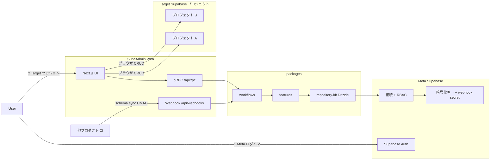

# SupaAdmin（日本語）

[](https://github.com/vividstudio-inc/supa-admin/actions/workflows/ci.yml)
[](https://codecov.io/gh/vividstudio-inc/supa-admin)
[](../../LICENSE)
[](../../package.json)
[](https://github.com/vividstudio-inc/supa-admin/releases)

[English README](../../README.md)

複数の Supabase プロジェクト（Target）を 1 つの管理画面から運用する、セルフホスト型 admin パネル。

[クイックスタート](#クイックスタート) · [アーキテクチャ](#アーキテクチャ) · [Contributing](../../CONTRIBUTING.md)

## 概要

SupaAdmin は、複数の Supabase プロジェクト（Target）を 1 つの管理画面から運用するためのセルフホスト型 admin パネルです。ユーザー・接続・RBAC は Meta Supabase に保持し、Target への CRUD はブラウザの Supabase クライアントで直接行います。

Supabase Dashboard との主な違い:

- 複数 Target を横断して管理できる
- チーム向け RBAC（接続・テーブル単位の権限）
- Target の `service_role` を Meta DB に暗号化保存（自己管理）

## ライブデモ

> **デモ URL:** TBD — 現時点ではセルフホストのみ。ローカル起動は [クイックスタート](#クイックスタート) を参照。

## アーキテクチャ



詳細は [Architecture](../architecture.md) を参照。

## クイックスタート

**前提**: Docker Desktop、Supabase CLI、Node 22.18+、pnpm 9.15+

```bash
corepack enable
pnpm install
pnpm db:start          # Meta (5432x) + Target (5442x)
pnpm setup:local       # env + reset + seed
pnpm dev               # http://127.0.0.1:3000
```

## 二段階認証

1. **Meta ログイン** — Supabase Auth（Meta プロジェクト）
2. **Target セッション** — 接続先ごとにブラウザ Supabase クライアントで認証

## モノレポ構成

```
apps/web/                    Next.js (@supa-admin/web)
packages/features/           ドメイン + application (feature-*)
packages/workflows/          横断オーケストレーション
packages/shared/             db, repository-kit, ddd, errors, ...
```

## 開発コマンド

| コマンド | 説明 |
|---------|------|
| `pnpm lint:arch` | dependency-cruiser（R1–R7） |
| `pnpm architecture-check` | 静的 grep ハーネス（A1–A4） |

## Webhook（CI schema sync）

接続ごとの secret を Connections UI で reveal/rotate。`POST /api/webhooks/schema-sync` に HMAC 付きで呼び出します。詳細は [English README](../../README.md#api) を参照。

## セキュリティ

Target の `service_role` キーは Meta DB に AES-256-GCM で暗号化して保存します。本番運用では `ENCRYPTION_KEY` と `SETUP_SECRET` を安全に管理してください。詳細は [SECURITY.md](../../SECURITY.md) を参照。

## ドキュメント

- [Architecture](../architecture.md)
- [Coding Standards](../coding-standards.md)
- [Testing](../testing.md)
- [AI エージェント向けガイド](../ai-agents.md) — `.ai-context/` SSOT、skills、MCP
- [Changelog](../../CHANGELOG.md)
- [Code of Conduct](../../CODE_OF_CONDUCT.md)
- [Contributing](../../CONTRIBUTING.md)

## スコープ外

- Managed SaaS ホスティング
- Realtime サブスクリプション UI
- Supabase 以外のデータベース
